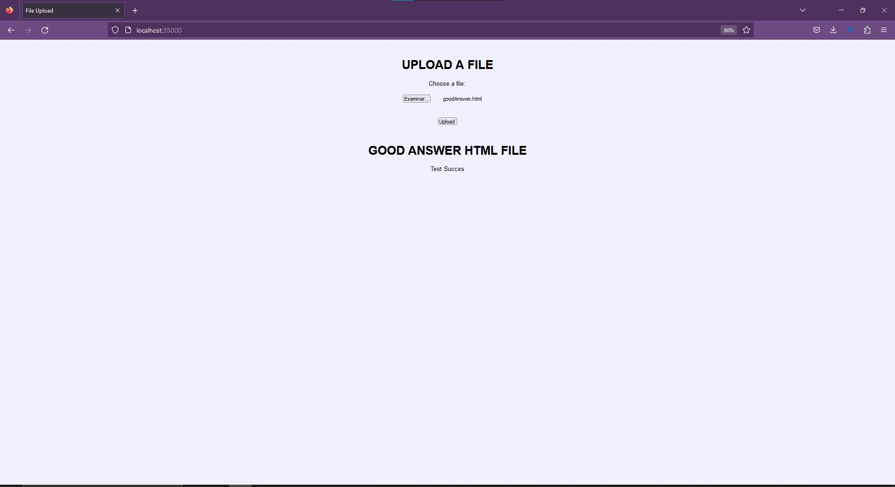
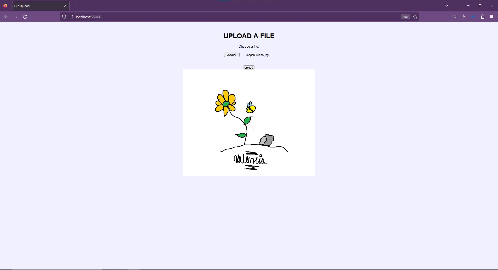
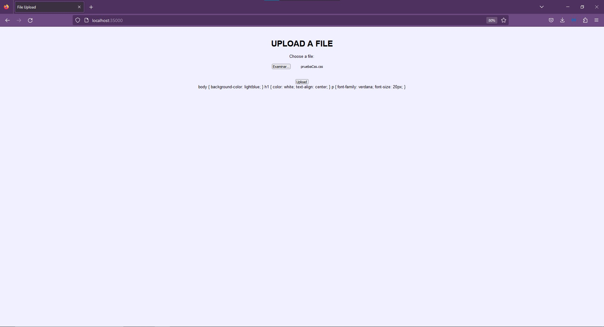
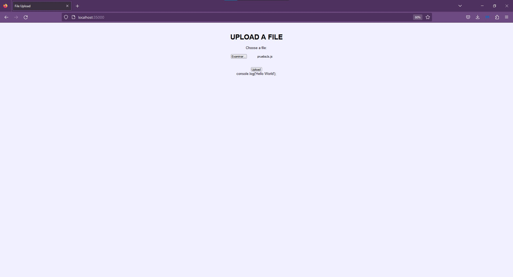

# LABORATORIO 2 AREP 2023-2
## Hecho Por : David Eduardo Valencia

Este Proyecto fue realizado con el fin de crear una aplicación web que use archivos alojados en el disco local de la maquina

## Instalación
Para instalar este proyecto basta con hacerle `git clone` o descargar el archivo zip de el mismo.\
Una vez instalado se debe de tener en cuenta que los archivos se encuentran en el siguiente directorio : [Archivos de Recursos](project2/src/main/resource/), si desea poner archivos ahi es el lugar.\
En cuanto a la ejecución solo se requiere hacer un `mvn package` dentro del [directorio](project2/) y luego ejecutando el [Archivo](project2/src/main/java/edu/eci/arep/HTTPServer.java).

Siempre se debe de seleccionar un archivo que se encuentre en el [Archivo de Recursos](project2/src/main/resource/) 

## Arquitectura
La aplicacion funciona como un RES en donde a travez de un metodo Post se obtiene la informacion obtenida este RES funciona abriendo un URL /upload de donde se obtendra el nombre del archivo en un content-type
Despues de eso se consigue el uri y con el uri se va a buscar que busque el /upload, ademas de eso se hace la busqueda despues del content-type se encuentra el nombre del archivo, luego lo que se hace es que con el nombre se busca el archivo en el directorio que se selecciono como path el cual esta como una direccion en el parrafo de instalación [Archivos](project2/src/main/resource/), y una vez con eso se hace el formato a html para que se muestre:

## Pruebas Hechas
Sobre todo son con imagenes y un html 

## Referencias
- https://es.stackoverflow.com/questions/8334/porque-el-tama%C3%B1o-de-una-imagen-codificada-en-base64-es-diferente-al-original
- https://www.techiedelight.com/es/base64-encoding-decoding-java/#:~:text=Codificaci%C3%B3n%20y%20decodificaci%C3%B3n%20Base64%20en%20Java%201%201.,4%204.%20Uso%20de%20la%20biblioteca%20Apache%20Commons
- https://es.stackoverflow.com/questions/25237/tomar-el-texto-de-un-archivo-plano-archivo-txt-y-guardarlo-en-un-string

- https://es.stackoverflow.com/questions/246369/como-aplicar-bufferedinputstream-stringbuilder-con-un-archivo-txt-en-java

